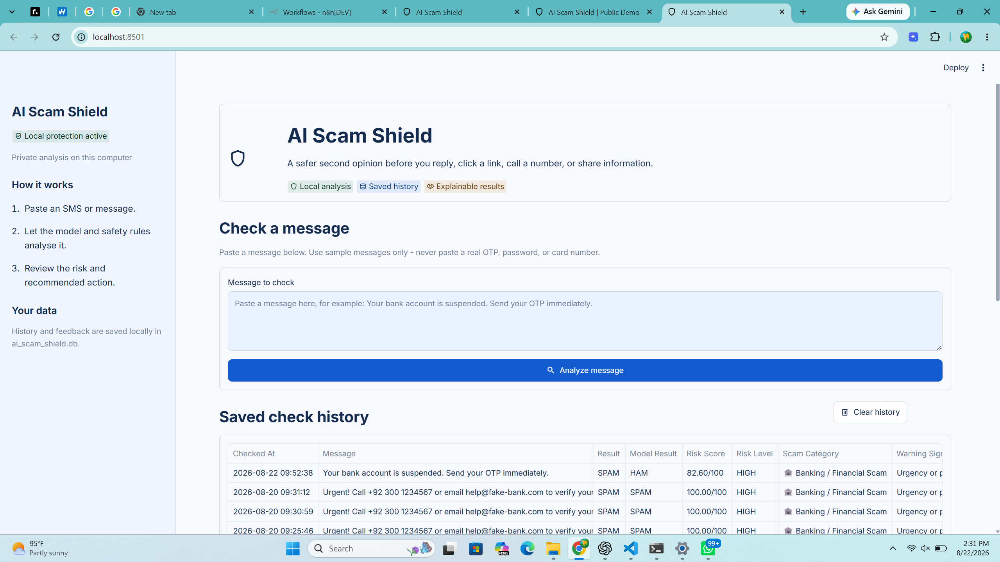

# AI Scam Shield

**AI Scam Shield** is an educational SMS scam-risk detector. Paste a message and the app combines a machine-learning prediction with explainable safety rules to show a risk score, warning signs, a likely scam category, and a recommended safe action.

[Open the live demo](https://ai-scam-shield-demo.streamlit.app/)

> Important: This project is a learning and awareness tool. It does not prove that a message is a scam. Never paste a real OTP, password, card number, bank detail, or other private secret into the app.

## Live app preview



## What it does

- Classifies SMS-style text as **HAM** (normal) or **SPAM** (suspicious) using a saved ML model.
- Gives a **risk score from 0 to 100** and labels the result as LOW, MEDIUM, or HIGH risk.
- Detects explainable warning signs such as urgency, prize language, requests for OTP/PIN/password details, payment language, suspicious URLs, phone numbers, and email addresses.
- Identifies likely scam categories, including banking/financial, phishing, prize/lottery, job, investment, delivery, and impersonation scams.
- Gives clear recommended actions, for example: do not share an OTP and contact a bank through its official website or phone number.
- Uses a privacy-focused public demo: visitor messages are analysed for the current page and are **not stored as history**.

## How the detection works

```text
Message text
    |
    +--> TF-IDF text vectorizer --> Logistic Regression ML model
    |
    +--> Explainable safety rules --> warning signs and detected details
    |
    +--> Risk-scoring engine --> final prediction, explanation, and advice
```

The model provides a data-based spam probability. The safety rules add real-world context. For example, an urgent request for an OTP can create a HIGH risk result even when the ML model is uncertain.

## Model evaluation

The saved model was evaluated on **1,034 held-out SMS messages**.

| Metric | Result |
| --- | ---: |
| Accuracy | 97.8% |
| Spam precision | 90.3% |
| Spam recall | 92.4% |
| F1-score | 91.3% |

These results are useful for a learning project, but no text classifier is perfect. Always independently verify unexpected messages through official channels.

## Technology used

| Area | Technology |
| --- | --- |
| Public user interface | Streamlit |
| Machine learning | Python, scikit-learn, TF-IDF, Logistic Regression |
| Saved model files | joblib |
| Rule-based safety layer | Python keyword rules and regular expressions |
| Local full-app storage | SQLite |
| Automation integration | FastAPI and n8n (local workflow) |
| Public hosting | Streamlit Community Cloud |

## Run the public demo locally

```powershell
git clone https://github.com/ahmadmustafa123666/ai-scam-shield.git
cd ai-scam-shield
python -m venv .venv
.\.venv\Scripts\python.exe -m pip install -r requirements.txt
.\.venv\Scripts\python.exe -m streamlit run public_demo.py
```

Then open the local address displayed in PowerShell, usually `http://localhost:8501`.

## Project structure

```text
ai-scam-shield/
|-- public_demo.py                 # Privacy-focused Streamlit app
|-- scam_shield.py                 # Shared ML and safety-rule analysis engine
|-- models/
|   |-- spam_model.pkl             # Saved classifier
|   `-- tfidf_vectorizer.pkl       # Saved text vectorizer
|-- requirements.txt
|-- .streamlit/
|   `-- config.toml                # Streamlit theme
`-- assets/
    `-- ai-scam-shield-home.png    # README screenshot
```

## Full local project features

The private local version has additional learning-project features:

- Permanent SQLite check history
- User feedback: mark a result as correct or incorrect
- Feedback analytics
- Model evaluation page with confusion matrix and incorrect-prediction examples
- FastAPI endpoints: `GET /health` and `POST /predict`
- A local n8n workflow that forwards an incoming webhook message to the API

The separate API repository is available at [AI Scam Shield API](https://github.com/ahmadmustafa123666/ai-scam-shield-api). The API/n8n workflow is currently a local demonstration; it should be deployed with authentication, HTTPS, rate limits, and environment variables before public use.

## Example message for a safe demo

```text
Urgent! Your bank account will be blocked today. Verify your OTP now at
http://fake-bank-login.com/verify or call +92 300 1234567.
```

Expected behaviour: the app should identify urgency, sensitive-information language, a suspicious URL, and a phone number, then return a high-risk banking/financial warning.

## Future improvements

- Review user feedback and carefully retrain the model with new labelled examples.
- Add multilingual training data.
- Add URL reputation checks without visiting unsafe links.
- Add secure authentication and a hosted API for online automation.
- Add screenshot/OCR and other multimodal scam-detection features.

## Author

**Ahmad Mustafa**

Built as an AI/ML learning project focused on scam awareness, explainable predictions, and safe user guidance.
